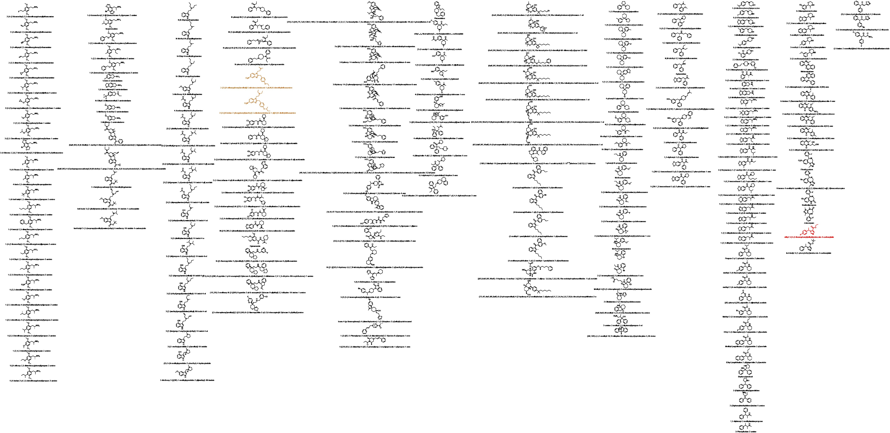

# 简介

设计药物是与管制物质的结构或功能的类似物，旨在模仿母体药物的药理作用，同时规避法律监管等。但还有许多其他的新型精神活性物质 ，可被视为设计药物的一部分。设计药物亦可称为设计师药物，狡诈家药物等。

## 结构式一览

## 表格

* [github](docs/designdrugs.md)
* <a href="https://benzyl-titanium.pages.dev/posts/drug/designdrugs" target="_blank">blog</a>

## 结构式文件

* [chemdraw的cdx和kingdraw的kdx](https://github.com/Benzyl-titanium/designdrugs/raw/main/docs/designdrugs.zip)

## 致谢

* [smilesDrawer](https://github.com/biantailab/smilesDrawer)

## 许可

<a href="https://creativecommons.org/licenses/by-nc-sa/4.0/?ref=chooser-v1" target="_blank" rel="license noopener noreferrer" style="display:inline-block;">CC BY-NC-SA 4.0</a>

